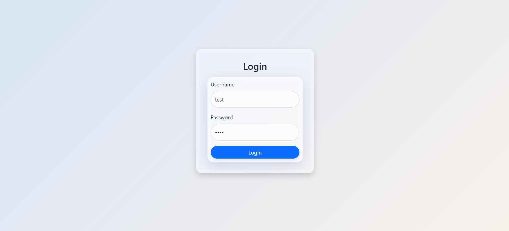
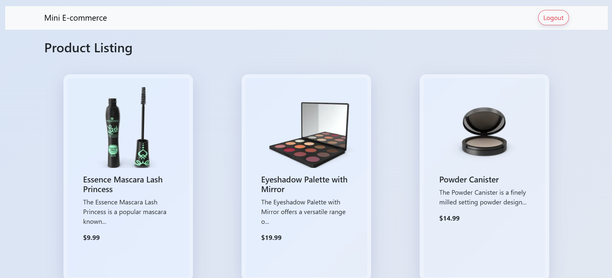

# Mini E-Commerce Final-Project

This is a simple mini e-commerce web application build with HTML, CSS, Bootstrap & JavaScript. The project demonstrates a basic login flow and a products page.

## Features

- **Log-In Page:**
    Simple login form with validation (demo credentials: test/test for the username and password).

- **Products Page:**
    Displays product listings after a successful login.

## Getting Started

1. **Clone The Repository:** git clone https://github.com/rue-rue98/Final-Project.git

2. **Open `login.html` In Your Browser**

3. **Log-In:**
    Enter the **Username:** test & **Password:** test to proceed to the products page.

## Project Structure

```
Final-Project/
├── login.html      # Login Page
├── products.html   # Products Listing Page
├── styles.css      # Custom Style (Glassmorphism Style)
└── README.md       # Project Information
```

## Screenshots

### Log-In Page


### Products Page
